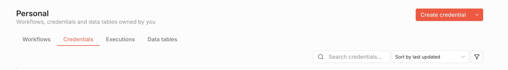
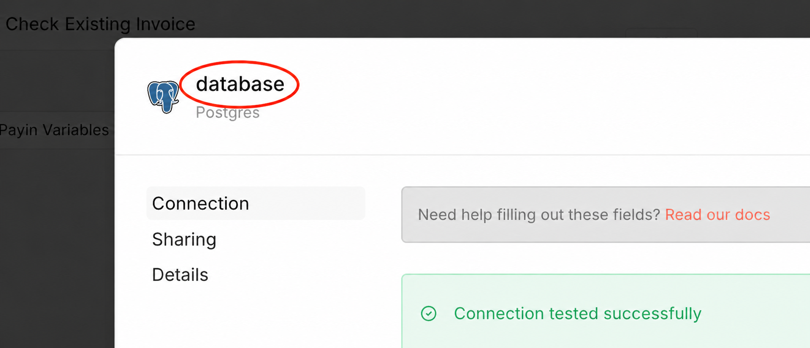
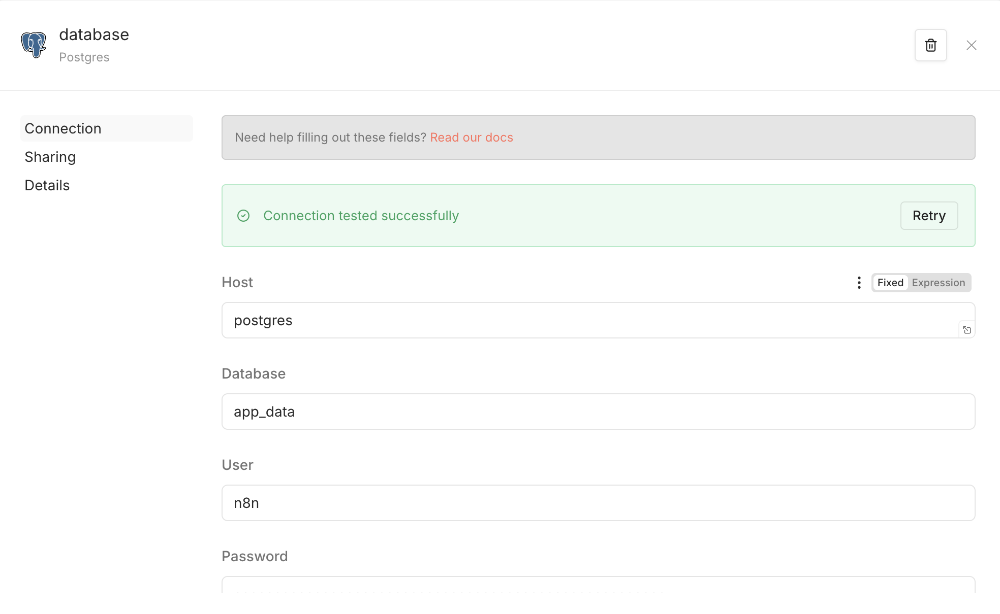
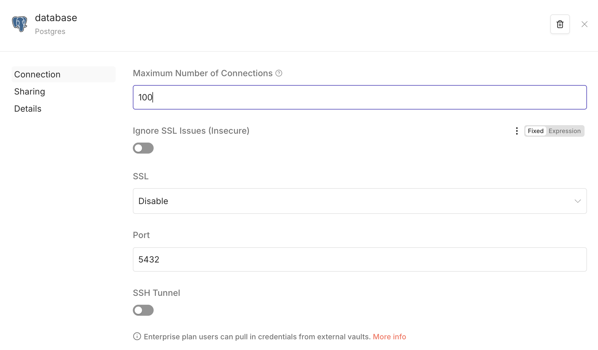
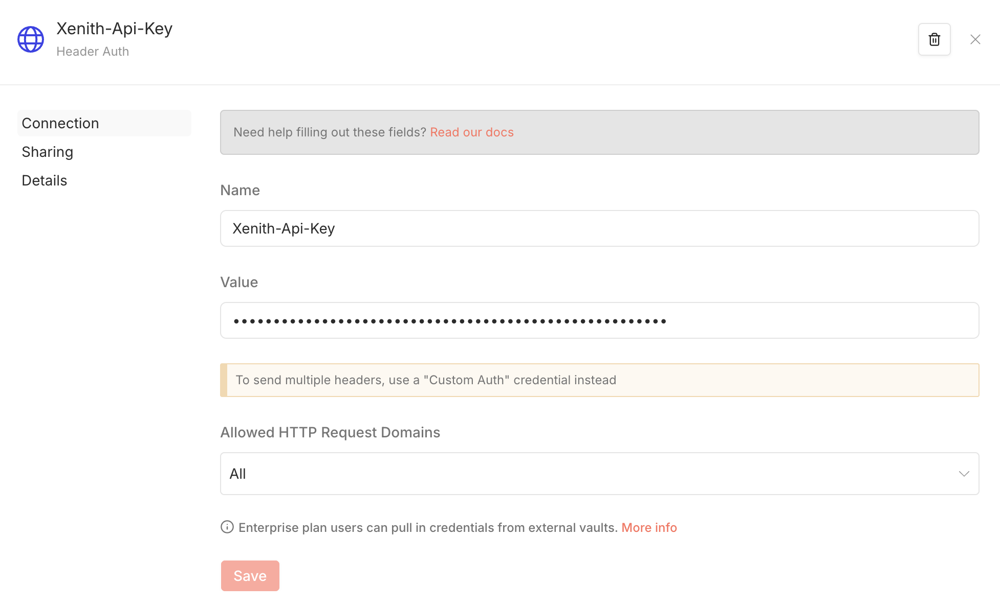
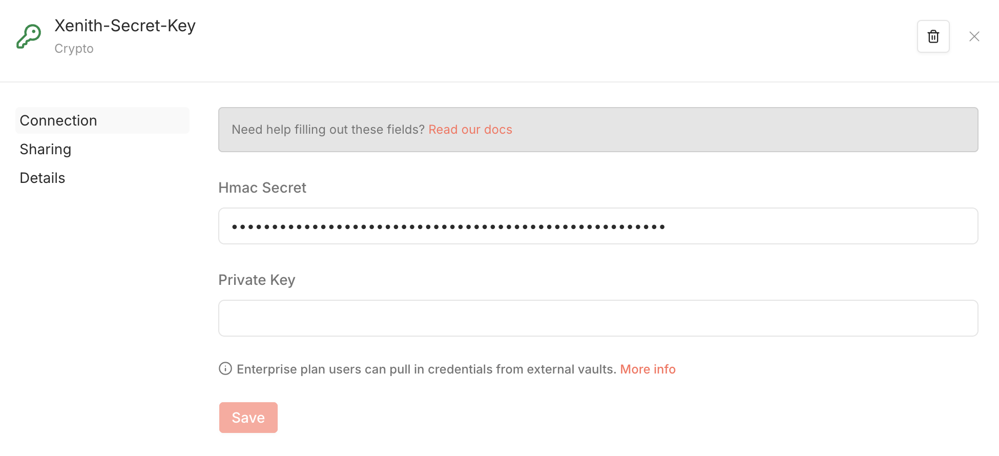
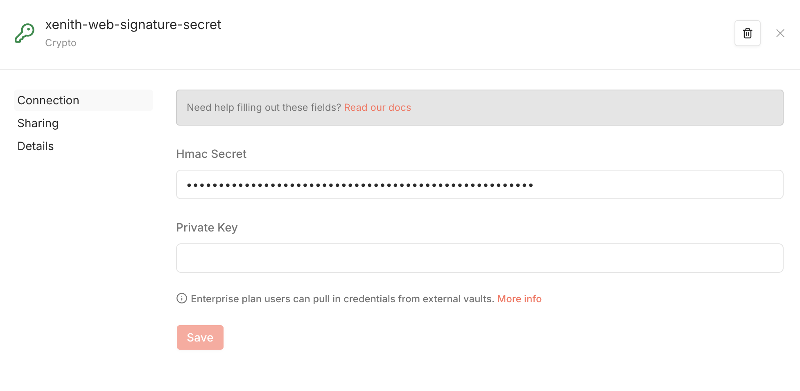
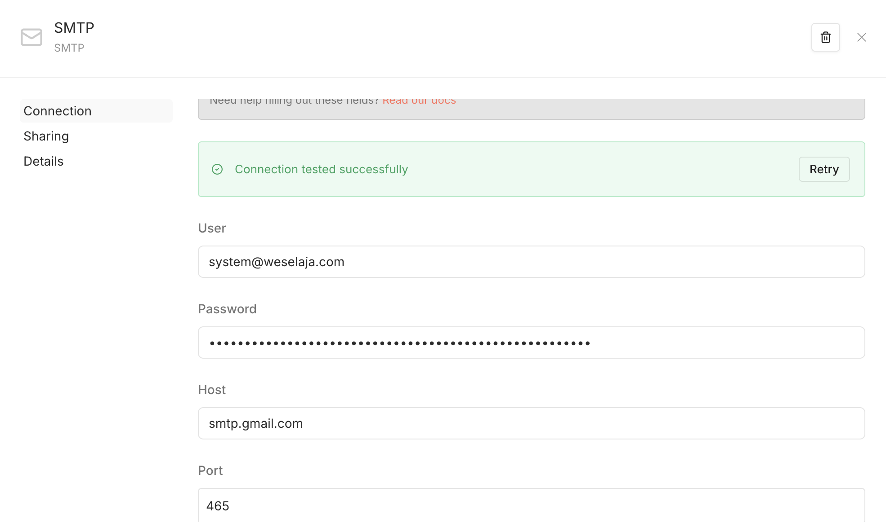
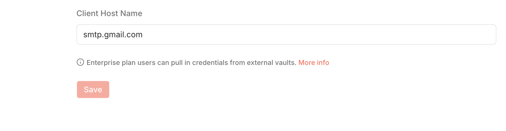

# XenithPay n8n Workflow Template

Template n8n ini menyediakan integrasi lengkap dengan **XenithPay** untuk memproses *Pay-In* (penerimaan pembayaran dari customer) dan *Pay-Out* (pencairan dana ke merchant). Template ini sudah siap digunakan untuk mode *Sandbox* dan didesain agar sangat mudah dipindahkan ke environment *Production*.

---

## 📋 Prasyarat

Sebelum memulai, pastikan Anda memiliki:
1. **n8n (Fresh Install / Instance Baru)**: Disarankan menggunakan instance n8n yang baru (belum ada project dan *credential* sebelumnya). Hal ini karena saat Anda meng-import template, n8n akan secara otomatis mengenali dan mempermudah pemetaan *Credentials* ke semua node, sehingga Anda tidak perlu melakukan setup manual satu per satu pada setiap *node*.
2. **PostgreSQL**: Database untuk menyimpan riwayat transaksi, referensi channel, dan variabel environment workflow.
3. **SMTP**: Konfigurasi email aktif untuk mengirim notifikasi dan invoice.
4. **Akun XenithPay**: *Credential* API Key dan Secret (untuk Sandbox atau Production).
5. **Public URL**: Domain publik untuk instance n8n Anda (bisa menggunakan `ngrok` untuk lokal) agar bisa menerima *Callback/Webhook* dari sistem XenithPay.

---

## 🚀 Setup Cepat

Ikuti langkah-langkah ini untuk menjalankan template:

### 1. Setup Database
Jalankan script SQL yang telah disediakan untuk membuat struktur tabel dan mengisi data channel default.
```bash
psql -h <host> -p 5432 -U <user> -d <database> -f xenithpay_database_setup.sql
```
*(Atau cukup copy-paste isi `xenithpay_database_setup.sql` dan jalankan di Query Editor PostgreSQL Anda).*

### 2. Konfigurasi Variabel
Perbarui tabel `variables` di database Anda dengan URL environment yang sesuai:
```sql
UPDATE public.variables
SET value = CASE key
  WHEN 'xenithpayEndpoint' THEN 'https://openapi.sandbox.xenithpay.com' -- Gunakan Sandbox API untuk testing
  WHEN 'n8nURL' THEN 'https://domain-n8n-anda.com' -- Base URL n8n Anda (tanpa garis miring / di akhir)
  WHEN 'homepageURL' THEN 'https://domain-website-anda.com' -- URL untuk tombol 'Kembali ke Beranda'
END
WHERE key IN ('xenithpayEndpoint', 'n8nURL', 'homepageURL');
```

### 3. Buat Credentials di n8n
**Sebelum** meng-import workflow, buat semua *Credentials* terlebih dahulu. Pada n8n yang baru, klik tombol **+** di pojok kiri atas, lalu pilih **Credential** untuk membuat masing-masing credential.



Buat *Credentials* berikut dengan nama **persis** seperti di bawah ini:

*(Penting: Penamaan credential harus sama persis agar saat import workflow, n8n otomatis menghubungkan credential ke semua node yang membutuhkannya. Lihat contoh gambar di bawah untuk posisi penamaan)*



1. **`database`**
   - **Tipe:** PostgreSQL
   - **Kegunaan:** Menyambung ke database Anda
   - **Yang harus diisi:**
     - **Host:** Alamat host server database Anda (contoh: `localhost` atau IP/URL server)
     - **Database:** Nama database Anda
     - **User:** Username database Anda
     - **Password:** Password database Anda
     - **Port:** Port database (biasanya `5432` atau `6543` jika menggunakan Supabase)
   
   
   

2. **`Xenith-Api-Key`**
   - **Tipe:** HTTP Header Auth
   - **Kegunaan:** Header autentikasi API XenithPay
   - **Yang harus diisi:**
     - **Name:** Masukkan `Xenith-Api-Key`
     - **Value:** Masukkan API Key dari dashboard XenithPay Anda
   
   

3. **`Xenith-Secret-Key`**
   - **Tipe:** Crypto HMAC
   - **Kegunaan:** Memverifikasi signature Pay-In & Pay-Out
   - **Yang harus diisi:**
     - **Secret:** Masukkan Secret Key dari dashboard XenithPay Anda
   
   

4. **`xenith-web-signature-secret`**
   - **Tipe:** Crypto HMAC
   - **Kegunaan:** Memverifikasi validitas Callback dari XenithPay
   - **Yang harus diisi:**
     - **Secret:** Masukkan Webhook Signature Secret dari pengaturan webhook XenithPay Anda
   
   

5. **`SMTP`**
   - **Tipe:** SMTP
   - **Kegunaan:** Mengirim email notifikasi
   - **Yang harus diisi:**
     - **User:** Alamat email pengirim
     - **Password:** Password email atau *App Password* (jika menggunakan Gmail/layanan serupa)
     - **Host:** Alamat host server SMTP (contoh: `smtp.gmail.com`)
     - **Port:** Port SMTP (biasanya `465` untuk SSL atau `587` untuk TLS)
     - **SSL/TLS:** Aktifkan (centang) jika provider email mewajibkan enkripsi
   
   
   

### 4. Import Workflow di n8n
1. Buka n8n dan buat *Workflow* baru.
2. Import file `Xenithpay Template.json`.
3. n8n akan **otomatis menghubungkan** semua *Credentials* yang sudah dibuat di langkah sebelumnya ke setiap node yang membutuhkannya.

### 5. Publish Workflow
Aktifkan workflow dengan mengklik tombol **Publish** di pojok kanan atas n8n.
**Penting:** Selalu gunakan URL webhook utama (`/webhook/...`), bukan test URL (`/webhook-test/...`) saat menerima callback otomatis dari XenithPay.

---

## 🗂 Struktur Tabel Database

Script database akan secara otomatis membuat 5 tabel ini:
- `variables`: Menyimpan konfigurasi URL secara dinamis (XenithPay Endpoint, n8n URL, Homepage URL).
- `invoices`: Menyimpan riwayat tagihan transaksi *Pay-In*.
- `payouts`: Menyimpan riwayat transaksi pencairan *Pay-Out*.
- `payment_channels`: Daftar metode pembayaran *Pay-In* yang didukung (QRIS, VA, E-Wallet).
- `payout_channels`: Daftar metode pencairan *Pay-Out* yang didukung (Bank, E-Wallet).

---

## 🔄 Alur Integrasi (Webhook Endpoints)

Anda bisa memicu workflow dengan melakukan pemanggilan HTTP GET ke endpoint n8n berikut:

### 1. Pay-In (Menerima Pembayaran)

#### Create Invoice
`GET <n8nURL>/webhook/create-invoice`

Membuat tagihan pembayaran baru, mengambil mapping channel dari PostgreSQL, membuat signature HMAC, mengirim request ke XenithPay, lalu mengirim email invoice ke customer.

**Input GET (Query Parameters):**
| Parameter | Keterangan |
|---|---|
| `customerName` | Nama customer |
| `email` | Email invoice; pada template ini juga dipakai sebagai `customerReference` |
| `initiated_amount` | Nominal pembayaran IDR |
| `paymentChannel` | Kode channel dari `payment_channels.channel`, contoh `QRIS`, `BRI.VA`, `DANA` |
| `phone_number` | Nomor telepon customer |
| `referenceCode` | Kode referensi transaksi (harus unik) |
| `description` | Deskripsi transaksi |

**Contoh:**
```
GET /webhook/create-invoice?customerName=John&email=example@customer.com&initiated_amount=50000&paymentChannel=BRI.VA&phone_number=08123456789&referenceCode=REF-001&description=Pembayaran+Produk
```

> **Catatan:** Jika `referenceCode` sudah pernah dipakai, endpoint akan mengembalikan `REFERENCE_ALREADY_EXISTS`.

---

#### Simulate Pay-In (Sandbox Only)
`GET <n8nURL>/webhook/simulate-payin`

Mensimulasikan status pembayaran di sandbox. Gunakan setelah invoice dibuat.

**Input GET (Query Parameters):**
| Parameter | Keterangan |
|---|---|
| `payin_id` | Transaction ID dari response create invoice atau email invoice |
| `transaction_status` | Status yang disimulasikan: `SUCCESS`, `FAILED`, atau `EXPIRED` |

**Contoh:**
```
GET /webhook/simulate-payin?payin_id=txn_abc123&transaction_status=SUCCESS
```

> **Catatan:** Endpoint simulator hardcoded ke `https://openapi.sandbox.xenithpay.com/v1/simulator/transaction`. Nonaktifkan flow ini saat workflow dipakai untuk production.

---

#### Callback Pay-In
Endpoint `<n8nURL>/webhook/xenith-payin` — Otomatis dipanggil oleh XenithPay saat status pembayaran berubah.

> **Catatan:** XenithPay sandbox tetap mengirim callback ke `/webhook/xenith-payin` (production webhook), bukan ke `/webhook-test/xenith-payin`.

---

#### Payment Status Page
Endpoint `<n8nURL>/webhook/payment?referenceCode=<referenceCode>` — Menampilkan halaman status pembayaran dari data invoice dan payment channel, lalu memberi tombol kembali ke homepage.

> **Catatan:** Pastikan `homepageURL` di tabel `variables` sudah diganti dengan URL homepage/front-end asli.

---

### 2. Pay-Out (Mencairkan Dana)

#### Create Payout
`GET <n8nURL>/webhook/create-payout`

Membuat permintaan pencairan dana ke rekening bank atau e-wallet tujuan.

**Input GET (Query Parameters):**
| Parameter | Keterangan |
|---|---|
| `amount` | Nominal payout IDR |
| `referenceCode` | Kode referensi unik payout |
| `payoutChannel` | Kode channel dari `payout_channels.channel`, contoh `CENAIDJA`, `BMRIIDJA`, `DANA`, `GOPAY` |
| `destinationPayoutAccount` | Nomor rekening atau akun tujuan |
| `destinationPayoutAccountName` | Nama pemilik rekening atau akun tujuan |
| `email` | Email notifikasi payout |

**Contoh:**
```
GET /webhook/create-payout?amount=100000&referenceCode=REF-TEST-1&payoutChannel=CENAIDJA&destinationPayoutAccount=555563765328&destinationPayoutAccountName=Andi+Prasetyo&email=example@merchant.com
```

> **Catatan:**
> - Jika `referenceCode` sudah pernah dipakai, endpoint akan mengembalikan `REFERENCE_ALREADY_EXISTS`.
> - Contoh sandbox `CENAIDJA`, `Andi Prasetyo`, dan `555563765328` merujuk dokumentasi XenithPay Simulate Pay Out agar callback payout sandbox bisa berjalan: `https://docs.xenithpay.com/reference/simulate-pay-out`.
> - Payout production XenithPay baru dapat diproses setelah 1 jam.

---

#### Callback Pay-Out
Endpoint `<n8nURL>/webhook/xenith-payout` — Otomatis dipanggil oleh XenithPay saat dana berhasil dicairkan.

> **Catatan:** XenithPay sandbox tetap mengirim callback ke `/webhook/xenith-payout` (production webhook), bukan ke `/webhook-test/xenith-payout`.

---

## 🌍 Pindah ke Production (Go-Live)

Jika Anda sudah selesai melakukan pengujian di *Sandbox* dan siap beralih ke *Production*:

1. Ubah nilai `xenithpayEndpoint` di tabel `variables` database menjadi: `https://openapi.xenithpay.com`.
2. Pastikan nilai `n8nURL` menggunakan domain n8n publik Anda yang valid.
3. Update semua *Credentials* (API Key, Secret Key, Webhook Signature Secret) di n8n dengan *Production Keys* yang didapat dari Dashboard XenithPay Anda.
4. Anda bisa mengabaikan endpoint `Simulate Payin` karena fungsi ini tidak tersedia di environment Production.

---

## 💡 Best Practices & Keamanan
- Pastikan `referenceCode` pada tagihan (*Invoice*) maupun *Payout* bersifat unik. Sistem akan menolak jika mendeteksi ID duplikat.
- Jangan pernah melakukan *commit* atau menyimpan *Credential* API di dalam kode source (selalu manfaatkan fitur *Credentials* milik n8n).
- Pada saat production, pastikan koneksi PostgreSQL Anda terlindungi dengan aturan *firewall* yang baik.
